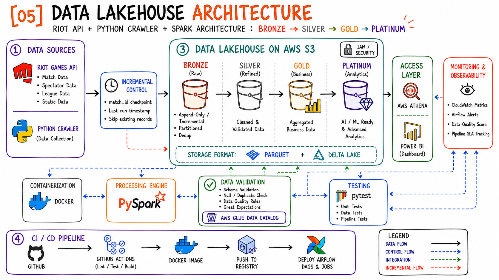
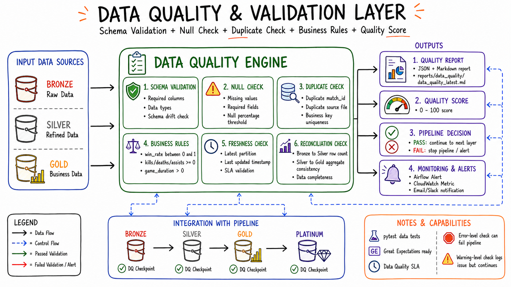

# Riot Lakehouse Platform


Riot Lakehouse Platform là project Data Lakehouse Pipeline end-to-end cho dữ liệu Riot Games API. Project mô phỏng một nền tảng dữ liệu hiện đại: crawler ghi raw JSON, Bronze ingest append-only có checkpoint, Silver clean/normalize/deduplicate/validate, Gold xây dựng dimension/fact/mart cho BI, Platinum cung cấp feature SQL registry cho AI/ML hoặc analytics nâng cao.

Project phù hợp để đưa vào GitHub portfolio cho Data Engineer: có Docker, Docker Compose, PySpark jobs, Apache Airflow DAGs, AWS S3/Glue/Athena integration path, Power BI dashboard references, pytest và CI bằng GitHub Actions.



## Mục Lục

- [Tính Năng Chính](#tính-năng-chính)
- [Architecture](#architecture)
- [Data Flow](#data-flow)
- [Tech Stack](#tech-stack)
- [Cấu Trúc Thư Mục](#cấu-trúc-thư-mục)
- [Quick Start](#quick-start)
- [Cấu Hình Môi Trường](#cấu-hình-môi-trường)
- [Chạy Docker](#chạy-docker)
- [Chạy Crawler](#chạy-crawler)
- [Chạy PySpark Jobs](#chạy-pyspark-jobs)
- [Chạy Airflow](#chạy-airflow)
- [AWS S3, Glue Data Catalog Và Athena](#aws-s3-glue-data-catalog-và-athena)
- [Power BI Dashboard](#power-bi-dashboard)
- [Data Quality](#data-quality)
- [Testing](#testing)
- [CI/CD](#cicd)
- [Troubleshooting](#troubleshooting)
- [Roadmap](#roadmap)
- [Security](#security)
- [Author](#author)

## Tính Năng Chính

- Lakehouse multi-layer theo mô hình `Bronze -> Silver -> Gold -> Platinum`.
- Ingest raw JSON từ Riot Games API theo contract `raw/{dataset}/*.json`.
- Bronze append-only, partition theo `dataset` và `ingest_date`, có checkpoint theo dataset.
- Silver chuẩn hóa schema, xử lý null, deduplicate theo business key và giữ lineage từ Bronze.
- Gold tạo dimension, fact và analytics mart cho dashboard Power BI.
- Platinum chứa SQL registry cho feature engineering và advanced analytics.
- Hỗ trợ local filesystem và AWS S3 thông qua config `dev`/`prod`.
- Airflow có DAG riêng từng layer và DAG full pipeline.
- Data quality sinh report JSON/Markdown.
- Test suite bằng pytest và CI bằng GitHub Actions.

## Architecture

Luồng kiến trúc tổng thể:

```text
Riot Games API
    -> Python Crawler
    -> raw/{dataset}/*.json
    -> Bronze Parquet
    -> Silver Parquet
    -> Gold Parquet
    -> Platinum feature SQL registry
    -> Glue Data Catalog / Athena
    -> Power BI Dashboard
```

Các thành phần chính:

| Thành phần | Vai trò |
| --- | --- |
| Riot Games API | Nguồn dữ liệu matches, timelines, summoners, ranked và các domain mở rộng |
| Python Crawler | Thu thập dữ liệu và ghi raw JSON theo contract |
| Bronze | Lưu payload gốc append-only, kèm metadata và checkpoint |
| Silver | Clean, normalize, validate, deduplicate dữ liệu domain |
| Gold | Tạo dimensional model, facts và marts phục vụ BI |
| Platinum | Chuẩn bị feature SQL cho AI/ML hoặc advanced analytics |
| AWS S3 | Data lake storage cho raw, lakehouse, checkpoint và report |
| AWS Glue Data Catalog | Catalog metadata để Athena/BI truy cập |
| AWS Athena | Query engine serverless trên S3 |
| Apache Airflow | Orchestration pipeline theo DAG |
| Power BI | Dashboard và phân tích dữ liệu |

## Data Flow

### Raw Layer

Crawler hoặc upstream data collection job ghi dữ liệu Riot API dưới dạng JSON:

```text
raw/
  matches/*.json
  timelines/*.json
  summoners/*.json
  ranked/*.json
```

Các dataset như `spectator`, `static`, `league` có thể bổ sung sau nếu crawler và Silver transformer được mở rộng.

### Bronze Layer

Bronze ingest dữ liệu raw JSON theo append-only:

- Input: `raw/{dataset}/*.json`
- Output local: `data/lakehouse/bronze/raw_json/`
- Output S3: `s3://<bucket>/<lakehouse-prefix>/bronze/raw_json/`
- Format: Parquet
- Partition: `dataset`, `ingest_date`
- Metadata: `source_file`, `file_hash`, `ingest_ts`, `ingest_date`, `dataset`, `payload`
- Checkpoint: `metadata/checkpoints/{dataset}.json`

Bronze giữ payload gốc để đảm bảo lineage, replay và audit.

### Silver Layer

Silver đọc Bronze, parse payload và tạo các bảng domain:

- `matches`
- `participants`
- `teams`
- `summoners`
- `ranked`
- `timeline_frames`
- `timeline_events`

Silver thực hiện schema normalization, null handling, deduplication theo business key và partition theo `dataset`, `game_date`.

### Gold Layer

Gold tạo mô hình analytics cho BI:

| Nhóm | Bảng |
| --- | --- |
| Dimensions | `dim_date`, `dim_match`, `dim_summoner`, `dim_champion`, `dim_team`, `dim_rank` |
| Facts | `fact_participant_performance`, `fact_team_objectives`, `fact_rank_snapshot`, `fact_timeline_frames`, `fact_timeline_events` |
| Marts | `mart_player_daily_performance`, `mart_champion_daily_performance`, `mart_role_daily_performance`, `mart_rank_daily_summary`, `mart_team_objective_daily_summary` |

### Platinum Layer

Platinum hiện là feature SQL registry, gồm:

- `match_win_features`
- `player_performance_features`
- `champion_meta_features`

Layer này có thể mở rộng để materialize feature tables phục vụ machine learning, champion meta analytics hoặc player performance modeling.

## Tech Stack

| Nhóm | Công nghệ |
| --- | --- |
| Language | Python 3.10+ |
| Processing | PySpark 3.5+ |
| Containerization | Docker, Docker Compose |
| Orchestration | Apache Airflow |
| Storage | Local filesystem, AWS S3 |
| File Format | Parquet, Delta Lake optional qua config |
| Catalog | AWS Glue Data Catalog |
| Query | AWS Athena |
| BI | Power BI |
| Testing | pytest |
| Lint | ruff |
| CI/CD | GitHub Actions |

## Cấu Trúc Thư Mục

```text
.
├── .github/workflows/        # GitHub Actions CI
├── configs/                  # dev/prod config và table metadata
├── dags/                     # Airflow DAGs
├── data/                     # Local lakehouse output
├── docs/images/              # Architecture và dashboard screenshots
├── metadata/                 # Checkpoints, Airflow metadata local
├── raw/                      # Raw Riot API JSON
├── reports/                  # Data quality reports
├── scripts/                  # Airflow entrypoint, helper scripts
├── sql/athena/               # Athena DDL templates
├── src/lakehouse/
│   ├── bronze/               # Bronze ingestion
│   ├── catalog/              # Glue/Athena catalog helpers
│   ├── common/               # Config, Spark, storage, checkpoint
│   ├── gold/                 # Gold transformations and aggregations
│   ├── jobs/                 # CLI entrypoints
│   ├── platinum/             # Feature SQL registry
│   ├── quality/              # Data quality rules and reports
│   ├── raw/                  # Raw discovery and dataset detection
│   ├── silver/               # Silver cleaners and transformer
│   └── validation/           # Validation helpers
└── tests/                    # Unit, data and pipeline tests
```

## Quick Start

```bash
docker compose build
docker compose run --rm lakehouse python -m lakehouse.jobs.run_bronze --env dev
docker compose run --rm lakehouse python -m lakehouse.jobs.run_silver --env dev
docker compose run --rm lakehouse python -m lakehouse.jobs.run_gold --env dev
docker compose run --rm lakehouse python -m lakehouse.jobs.run_data_quality --env dev
```

Chạy full pipeline:

```bash
docker compose run --rm lakehouse python -m lakehouse.jobs.run_full_pipeline --env dev
```

Chạy test:

```bash
docker compose run --rm lakehouse pytest -q
```

## Cấu Hình Môi Trường

Tạo `.env` từ file mẫu:

```powershell
Copy-Item .env.example .env
```

macOS/Linux:

```bash
cp .env.example .env
```

Các biến quan trọng:

```env
RIOT_API_KEY=

LAKEHOUSE_ENV=dev
LAKEHOUSE_CONFIG_DIR=configs
LAKEHOUSE_ENV_FILE=.env

LAKEHOUSE_RAW_ROOT=raw
LAKEHOUSE_ROOT=data/lakehouse
LAKEHOUSE_CHECKPOINT_ROOT=metadata/checkpoints
LAKEHOUSE_REPORT_ROOT=reports

AWS_REGION=ap-southeast-1
S3_BUCKET=
S3_RAW_PREFIX=raw
S3_LAKEHOUSE_PREFIX=lakehouse
S3_CHECKPOINT_PREFIX=metadata/checkpoints
S3_REPORT_PREFIX=reports
ATHENA_DATABASE=riot_lakehouse

SPARK_MASTER=local[*]
SPARK_DRIVER_MEMORY=4g
SPARK_SHUFFLE_PARTITIONS=8
SPARK_DEFAULT_PARALLELISM=8
SPARK_ENABLE_DELTA=false
SPARK_INCLUDE_HADOOP_AWS_PACKAGE=true

AIRFLOW_PORT=8088
_AIRFLOW_WWW_USER_USERNAME=admin
_AIRFLOW_WWW_USER_PASSWORD=admin
```

Local config: `configs/dev.yaml`  
Production/S3 config: `configs/prod.yaml`

## Chạy Docker

Build image:

```bash
docker compose build
```

Chạy command mặc định của service `lakehouse`:

```bash
docker compose run --rm lakehouse
```

Command mặc định tương đương:

```bash
python -m lakehouse.jobs.run_bronze
```

Chạy một command tùy chỉnh:

```bash
docker compose run --rm lakehouse python -m lakehouse.jobs.run_silver --env dev
```

## Chạy Crawler

Repo này xử lý dữ liệu raw JSON đã được crawler ghi ra `raw/` hoặc S3. Contract đầu ra của crawler:

```text
raw/{dataset}/*.json
```

Ví dụ:

```text
raw/matches/VN2_1032611162.json
raw/timelines/VN2_1032611162.json
raw/summoners/<puuid>.json
raw/ranked/<queue-or-league>.json
```

Crawler nên đảm bảo:

- Dùng `RIOT_API_KEY` từ `.env`.
- Không hard-code API key trong source code.
- Lưu response nguyên bản ở dạng JSON.
- Có incremental checkpoint theo `match_id`, `last_run_timestamp` hoặc file state.
- Bỏ qua record đã tồn tại.
- Tôn trọng Riot API rate limit.

Sau khi crawler ghi raw JSON, chạy Bronze:

```bash
docker compose run --rm lakehouse python -m lakehouse.jobs.run_bronze --env dev
```

## Chạy PySpark Jobs

### Bronze

```bash
docker compose run --rm lakehouse python -m lakehouse.jobs.run_bronze --env dev
```

Chạy theo dataset:

```bash
docker compose run --rm lakehouse python -m lakehouse.jobs.run_bronze --env dev --datasets matches timelines
```

Giới hạn số file hoặc batch size:

```bash
docker compose run --rm lakehouse python -m lakehouse.jobs.run_bronze --env dev --datasets timelines --max-files 500 --batch-size 25
```

### Silver

```bash
docker compose run --rm lakehouse python -m lakehouse.jobs.run_silver --env dev
```

Chạy theo dataset:

```bash
docker compose run --rm lakehouse python -m lakehouse.jobs.run_silver --env dev --datasets matches,timelines
```

Chạy theo bảng:

```bash
docker compose run --rm lakehouse python -m lakehouse.jobs.run_silver --env dev --tables matches,participants,teams
```

### Gold

```bash
docker compose run --rm lakehouse python -m lakehouse.jobs.run_gold --env dev
```

Chạy một số bảng:

```bash
docker compose run --rm lakehouse python -m lakehouse.jobs.run_gold --env dev --tables dim_summoner,mart_player_daily_performance
```

### Platinum

```bash
docker compose run --rm lakehouse python -m lakehouse.jobs.run_platinum --env dev
```

Job hiện tại in ra feature SQL registry. Có thể mở rộng để ghi feature tables ra `data/lakehouse/platinum/` hoặc S3.

### Data Quality

```bash
docker compose run --rm lakehouse python -m lakehouse.jobs.run_data_quality --env dev
```

Chạy riêng Gold:

```bash
docker compose run --rm lakehouse python -m lakehouse.jobs.run_data_quality --env dev --layers gold
```

Fail job nếu có error-level rule:

```bash
docker compose run --rm lakehouse python -m lakehouse.jobs.run_data_quality --env dev --fail-on-error
```

## Chạy Local Không Dùng Docker

Cài package:

```bash
pip install -e ".[dev,spark,aws]"
```

Chạy jobs:

```bash
python -m lakehouse.jobs.run_bronze --env dev
python -m lakehouse.jobs.run_silver --env dev
python -m lakehouse.jobs.run_gold --env dev
python -m lakehouse.jobs.run_data_quality --env dev
```

## Chạy Airflow

Start Airflow webserver và scheduler:

```bash
docker compose --profile airflow up --build airflow
```

Mở UI:

```text
http://localhost:8088
```

Nếu `AIRFLOW_PORT` không được set, Docker Compose dùng default `8080`.

Login mặc định trong `.env.example`:

```text
username: admin
password: admin
```

Các DAG hiện có:

| DAG | Mục đích |
| --- | --- |
| `riot_bronze_ingestion` | Chạy Bronze ingestion |
| `riot_silver_transform` | Chạy Silver transform |
| `riot_gold_model` | Chạy Gold transform |
| `riot_platinum_features` | Chạy Platinum feature registry |
| `riot_full_lakehouse_pipeline` | Chạy `Bronze -> Silver -> Gold -> Platinum -> Data Quality` |

Airflow metadata local được lưu tại `metadata/airflow/`.

## AWS S3, Glue Data Catalog Và Athena

### Cấu Hình S3

Tạo `.env.prod`:

```env
LAKEHOUSE_ENV=prod
LAKEHOUSE_ENV_FILE=.env.prod

AWS_REGION=ap-southeast-1
AWS_PROFILE=
AWS_ACCESS_KEY_ID=<your-access-key>
AWS_SECRET_ACCESS_KEY=<your-secret-key>
AWS_SESSION_TOKEN=
AWS_S3_ENDPOINT_URL=
AWS_S3_PATH_STYLE_ACCESS=false

S3_BUCKET=<your-riot-lakehouse-bucket>
S3_RAW_PREFIX=raw
S3_LAKEHOUSE_PREFIX=lakehouse
S3_CHECKPOINT_PREFIX=metadata/checkpoints
S3_REPORT_PREFIX=reports
ATHENA_DATABASE=riot_lakehouse
```

Chạy pipeline với production config:

```powershell
$env:LAKEHOUSE_ENV_FILE=".env.prod"
docker compose --env-file .env.prod run --rm lakehouse python -m lakehouse.jobs.run_full_pipeline --env prod
```

macOS/Linux:

```bash
docker compose --env-file .env.prod run --rm lakehouse python -m lakehouse.jobs.run_full_pipeline --env prod
```

`configs/prod.yaml` map các root path sang S3:

| Config | S3 path |
| --- | --- |
| `raw_root` | `s3://<bucket>/<raw-prefix>` |
| `lakehouse_root` | `s3://<bucket>/<lakehouse-prefix>` |
| `checkpoint_root` | `s3://<bucket>/<checkpoint-prefix>` |
| `report_root` | `s3://<bucket>/<report-prefix>` |

### Glue Data Catalog

Athena dùng Glue Data Catalog để quản lý metadata. DDL templates nằm tại:

```text
sql/athena/create_bronze_tables.sql
sql/athena/create_silver_tables.sql
sql/athena/create_gold_tables.sql
sql/athena/create_platinum_tables.sql
```

Khi tạo bảng trên Athena, bổ sung `LOCATION` tương ứng với S3 output của từng bảng:

```sql
CREATE EXTERNAL TABLE IF NOT EXISTS riot_lakehouse.silver_matches (
  match_id string,
  game_creation bigint
)
PARTITIONED BY (dataset string, game_date string)
STORED AS PARQUET
LOCATION 's3://<bucket>/lakehouse/silver/matches/';
```

Sau khi tạo bảng partitioned:

```sql
MSCK REPAIR TABLE riot_lakehouse.silver_matches;
```

Có thể thay bước repair bằng Glue Crawler nếu muốn tự động phát hiện partition.

### Athena Query Ví Dụ

```sql
SELECT
  game_date,
  champion_id,
  champion_name,
  matches_played,
  win_rate
FROM riot_lakehouse.gold_mart_champion_daily_performance
ORDER BY game_date DESC, matches_played DESC
LIMIT 50;
```

```sql
SELECT
  game_date,
  puuid,
  summoner_name,
  matches_played,
  avg_kda
FROM riot_lakehouse.gold_mart_player_daily_performance
ORDER BY game_date DESC, matches_played DESC;
```

## Power BI Dashboard

Power BI nên đọc các bảng Gold marts qua Athena:

- `gold_mart_player_daily_performance`
- `gold_mart_champion_daily_performance`
- `gold_mart_role_daily_performance`
- `gold_mart_rank_daily_summary`
- `gold_mart_team_objective_daily_summary`

Các bước kết nối:

1. Ghi Gold tables lên S3 bằng `LAKEHOUSE_ENV=prod`.
2. Tạo Glue/Athena external tables.
3. Cấu hình Athena query result location, ví dụ `s3://<bucket>/athena-results/`.
4. Kết nối Power BI bằng Amazon Athena connector hoặc ODBC driver.
5. Import hoặc DirectQuery các bảng mart.

Dashboard overview:


Match analytics:


Gợi ý KPI:

- Tổng số match theo ngày.
- Win rate và pick rate theo champion.
- KDA, damage, gold earned và vision score theo player.
- Hiệu suất theo role/lane.
- Ranked distribution theo tier/rank.
- Objective control: dragon, baron, tower.
- Data Quality Score theo pipeline run.

## Data Quality

Chạy data quality:

```bash
docker compose run --rm lakehouse python -m lakehouse.jobs.run_data_quality --env dev
```

Ảnh minh họa report Data Quality:



Report output:

```text
reports/data_quality/data_quality_latest.json
reports/data_quality/data_quality_latest.md
```

Các rule tiêu biểu:

- Table existence.
- Row count.
- Expected columns.
- Required values not null.
- Unique business key.
- Non-negative metrics.
- Win-rate range.
- Aggregate consistency.

## Testing

Chạy toàn bộ test:

```bash
pytest -q
```

Chạy test trong Docker:

```bash
docker compose run --rm lakehouse pytest -q
```

Chạy một file test:

```bash
pytest tests/test_silver_transform.py -q
```

Lint:

```bash
ruff check src tests dags
```

Test suite hiện bao phủ config loading, raw detection, checkpoint, Bronze ingestion, Silver transform, Gold aggregation, Platinum registry, data quality rules và Airflow DAG imports.

## CI/CD

GitHub Actions workflow hiện có tại `.github/workflows/ci.yml`:

```yaml
name: ci

on:
  push:
  pull_request:

jobs:
  test:
    runs-on: ubuntu-latest
    steps:
      - uses: actions/checkout@v4
      - uses: actions/setup-python@v5
        with:
          python-version: "3.11"
      - run: pip install -e ".[dev]"
      - run: ruff check src tests dags
      - run: pytest -q
```

Hướng mở rộng CI/CD:

1. Build Docker image.
2. Push image lên registry.
3. Deploy Airflow DAGs.
4. Deploy Spark jobs hoặc container job.
5. Chạy smoke test trên staging.
6. Gửi alert khi pipeline fail.

Secrets nên đặt trong GitHub Actions Secrets:

- `RIOT_API_KEY`
- `AWS_ACCESS_KEY_ID`
- `AWS_SECRET_ACCESS_KEY`
- `AWS_REGION`
- `S3_BUCKET`

## Troubleshooting

| Vấn đề | Cách xử lý |
| --- | --- |
| `raw/` không có dữ liệu | Kiểm tra crawler đã ghi đúng contract `raw/{dataset}/*.json` chưa |
| Bronze không ingest thêm file | Kiểm tra checkpoint tại `metadata/checkpoints/{dataset}.json` |
| Spark thiếu Java | Cài Java 17 hoặc chạy bằng Docker |
| Airflow UI không mở | Kiểm tra `AIRFLOW_PORT`, thử `http://localhost:8088` hoặc `http://localhost:8080` |
| Airflow login fail | Kiểm tra `_AIRFLOW_WWW_USER_USERNAME` và `_AIRFLOW_WWW_USER_PASSWORD` trong `.env` |
| S3 path lỗi | Kiểm tra `S3_BUCKET`, AWS credentials và `LAKEHOUSE_ENV=prod` |
| Athena không thấy partition mới | Chạy `MSCK REPAIR TABLE` hoặc dùng Glue Crawler |
| Power BI không query được Athena | Kiểm tra Athena result location, IAM permission và ODBC/Athena connector |
| Data quality FAIL | Mở `reports/data_quality/data_quality_latest.md` để xem rule fail |

## Roadmap

- [x] Bronze append-only ingestion với checkpoint.
- [x] Silver normalized domain tables.
- [x] Gold dimensions, facts và marts.
- [x] Data quality JSON/Markdown reports.
- [x] Airflow DAGs cho từng layer và full pipeline.
- [x] GitHub Actions CI cho lint/test.
- [ ] Materialize Platinum feature tables.
- [ ] Bổ sung crawler module chính thức trong repo.
- [ ] Thêm dataset `spectator`, `static`, `league`.
- [ ] Tự động register Glue/Athena tables.
- [ ] Hỗ trợ Delta Lake/Iceberg table format ở production.
- [ ] Thêm alerting qua Airflow/CloudWatch.
- [ ] Thêm dashboard screenshots thực tế vào `docs/images/`.

## Security

- Không commit `.env`, Riot API key hoặc AWS credentials.
- Dùng IAM role, AWS profile hoặc secrets manager thay cho static keys ở production.
- Rotate Riot API key và AWS access keys định kỳ.
- Không public raw data nếu dữ liệu vi phạm Riot Games API policy hoặc chứa thông tin không nên chia sẻ.
- Chỉ commit sample data nhỏ đã được kiểm tra.
- Cấu hình least privilege cho S3, Glue và Athena.

## Author

**Riot Lakehouse Platform** được xây dựng như một project portfolio cho Data Engineering, tập trung vào batch pipeline, lakehouse modeling, orchestration, data quality và BI analytics.

Maintainer: `Kung`
